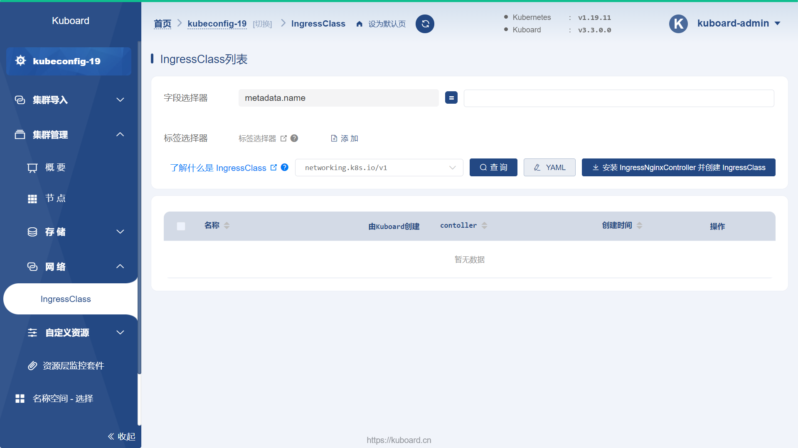
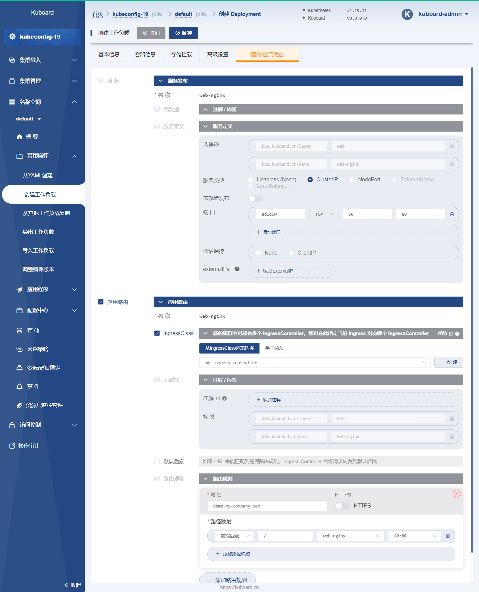
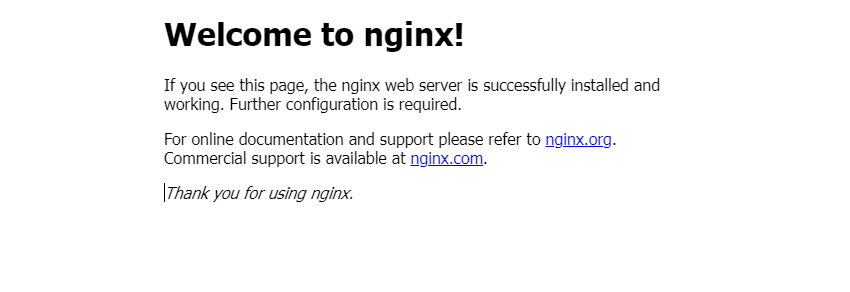

# 通过 Ingress 访问您的应用

<AdSenseTitle/>

参考文档：
* Kubernetes  [Ingress](https://kubernetes.io/docs/concepts/services-networking/ingress/)
* Kubernetes  [Ingress Controllers](https://kubernetes.io/docs/concepts/services-networking/ingress-controllers/)
* Kubernetes Nginx Ingress Controller [Bare-metal considerations](https://kubernetes.github.io/ingress-nginx/deploy/baremetal/)
* nginxinc/kubernets-ingress [kubernetes-ingress](https://github.com/nginxinc/kubernetes-ingress)

## Ingress

Ingress 是 Kubernetes 的一种 API 对象，将集群内部的 Service 通过 HTTP/HTTPS 方式暴露到集群外部，并通过规则定义 HTTP/HTTPS 的路由。Ingress 具备如下特性：集群外部可访问的 URL、负载均衡、SSL Termination、按域名路由（name-based virtual hosting）。Ingress 的例子如下所示：

```yaml
apiVersion: networking.k8s.io/v1
kind: Ingress
metadata:
  name: my-ingress-for-nginx  # Ingress 的名字，仅用于标识
spec:
  rules:                      # Ingress 中定义 L7 路由规则
  - host: demo.my-company.com   # 根据 virtual hostname 进行路由（请使用您自己的域名）
    http:
      paths:                  # 按路径进行路由
      - path: /
        backend:
          serviceName: nginx-service  # 指定后端的 Service 为之前创建的 nginx-service
          servicePort: 80
```

Ingress Controller 通常是部署在集群中的一个 Deployment，并且通过 NodePort Service 暴露自己的端口，使得用户可以在集群外通过其 NodePort 访问到 Ingress Controller，假设该端口为 `32351`，并且 `demo.my-company.com` 这个域名被解析到集群中某一个节点的 IP（或者被配置到浏览器所在机器的 hosts 文件），则当用户在浏览器中输入地址 `http://demo.my-company.com:32351` 时：

1. 请求被转发到集群某节点的 `32351` 节点端口；
2. 根据 Service 的定义，请求被转发到 Ingress Controller 的 Web 端口；
3. Ingress Controller 根据请求域名 `demo.my-company.com` 以及请求路径，匹配到 Ingress 定义中该请求应该被路由到 `nginx-service` 的 `80` 端口；
4. Ingress Controller 执行 L7 路由转发，将请求发送到 `nginx-service` 的 `80` 端口。

## 安装 Ingress Controller

Kuboard 为您提供了一种快速安装 `ingress-nginx` 的方法，步骤如下所示：

> * Kubernetes 集群版本不低于 v1.19
> * Kuboard 版本不低于 v3.3.0.0

* 导航到集群的 `集群管理` --> `网络` --> `IngressClass` 列表页，如下图所示：
  
  

* 点击图中的 `安装 IngressNginxController 并创建 IngressClass` 的按钮，如下图所示：

  > 假设名称为 `my-ingress-controller`

  

* 完成 Ingress Controller 的创建后，将进入如下界面：

  ::: tip 负载均衡
  1. 通常，您需要在集群外配置一个负载均衡器，并将负载均衡器接收到的所有请求转发到 Ingress Controller 对应的节点端口；
  2. 为了快速验证，在不配置负载均衡器的情况下，可以将业务域名直接解析到集群的某一个节点，并在访问时，在域名后面增加节点端口；
  :::

  

## 实战：使用 Ingress 访问 Web 应用

<SharingBlock>

::: warning 前提
* 假设您已经完成了 [公布应用程序](/learning/k8s-basics/expose.html) 中的实战部分
* 假设您已经将 `demo.my-company.com` 解析到集群的某一个节点 IP （或者已配置到 hosts 文件中）
:::


* 在 default 名称空间 点击左侧菜单栏中的 ***创建工作负载***，如下图所示：

    

    填写表单如下：

    | 字段名称   | 填写内容                                                     | 备注                                                         |
    | ---------- | ------------------------------------------------------------ | ------------------------------------------------------------ |
    | 服务类型   | Deployment                                                   |                                                              |
    | 服务分层   | 展现层                                                       |                                                              |
    | 服务名称   | web-nginx                                                    |                                                              |
    | 服务描述   | nginx部署                                                    |                                                              |
    | 副本数量   | 1                                                            | 可以填写其他正整数                                           |

* 切换到 ***容器信息*** Tab 页，并点击 `添加工作容器` 按钮，如下图所示：

    

    填写表单如下：

    | 字段名称 | 填写内容    | 备注 |
    | -------- | ----------- | ---- |
    | 容器名称 | nginx       |      |
    | 镜像     | nginx:1.7.9 |      |
    | 抓取策略 | Always      |      |

* 切换到 ***服务/应用路由*** Tab 页，如下图所示：

    

    填写表单如下：

    | 字段名称 | 填写内容                                                     | 备注                                                         |
    | -------- | ------------------------------------------------------------ | ------------------------------------------------------------ |
    | 服务     | NodePort（VPC内访问）<br />协议: TCP<br />port: 80<br />targetPort: 80 | 服务对应 Kubernetes Service对象，<br />工作负载编辑器为其使用与 Deployment 相同的名字 web-nginx |
    | 应用路由 | IngressClass：my-ingress-controller <br/>域名: demo.my-company.com<br />映射URL： /<br />服务端口：80   | 应用路由对应 Kubernetes Ingress对象，<br />工作负载编辑器为其使用与 Deployment 相同的名字 web-nginx |

    

  ::: tip
  Kuboard 工作负载编辑器假设 kubernetes 中三个主要对象 Deployment/Service/Ingress 名称相同，并放在同一个编辑器界面中处理。
  :::

* 点击 **保存**

* 点击 **应用**

* **从浏览器访问**

  在浏览器打开 `http://demo.my-company.com:32351`，如下图所示：

  ::: tip 节点端口
  根据您安装 IngressController 的结果，您应该使用的端口号极有可能不是 `32351`，请使用您的在 [安装 Ingress Controller](./ingress.html#安装-ingress-controller) 这个步骤中获得的 IngressController 的节点端口。
  :::

  


</SharingBlock>
